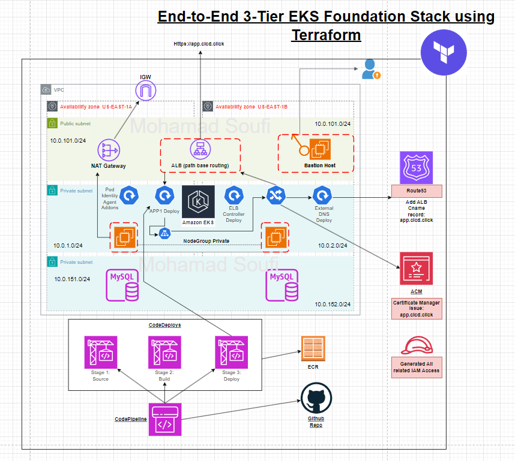

# End-to-End 3-Tier EKS Foundation Stack using Terraform




## 📖 Overview

This project provisions a production-grade **Amazon EKS (Elastic Kubernetes Service)** cluster within a custom **3-Tier VPC Architecture** using **Terraform**. It implements modern DevOps best practices, including Infrastructure as Code (IaC), automated CI/CD pipelines (AWS CodePipeline & CodeBuild), and Devops-style deployments.

The stack is designed for High Availability (HA), security, and automation, featuring integrated **AWS Load Balancer Controller** and **ExternalDNS** for automated ingress and DNS management.

---

## 🏗️ Architecture

The infrastructure follows a secure 3-tier network design across multiple Availability Zones:

1.  **Public Layer:** NAT Gateways and Bastion Hosts (for secure access).
2.  **Private Application Layer:** EKS Control Plane, Worker Nodes (Managed Node Groups), and Application Pods.
3.  **Data Layer:** Private subnets reserved for Databases (RDS/DynamoDB).

---

## 🚀 Key Features

* **Automated Remote Backend:** Bash script to automatically provision S3 buckets and DynamoDB tables for Terraform state locking.
* **Custom VPC:** 3-Tier architecture (Public, Private, Database subnets) spanning 2 Availability Zones.
* **Secure Access:** Bastion Host provisioned in the public subnet for secure SSH access to private nodes.
* **EKS Cluster:** Fully managed Control Plane with Private Node Groups.
* **Add-ons & Controllers:**
    * **AWS Load Balancer Controller (LBC):** Automates ALB/NLB creation via Kubernetes Ingress.
    * **ExternalDNS:** Automates Route53 record management.
    * **EKS Pod Identity Agent:** Modern IAM permission management for pods.
* **CI/CD Pipeline:** Full AWS native pipeline (CodePipeline, CodeBuild, ECR) for building Docker images and deploying manifests.

---

## 🛠️ Project Structure

```text
Deploy-EKS-TF/
├── c1-01-provider.tf                # AWS Provider definition
├── c3-*-vpc.tf                      # VPC, Subnets, IGW, NAT Gateway setup
├── c4-*-ec2bastion.tf               # Bastion Host configuration
├── c5-*-eks.tf                      # EKS Cluster, Node Groups, IAM Roles
├── c6-*-externaldns.tf              # ExternalDNS Helm installation & IAM
├── c7-*-lbc.tf                      # Load Balancer Controller Helm & IAM
├── c8-01-ecr.tf                     # Elastic Container Registry
├── c9-*-codebuild-codepipeline.tf   # CI/CD Resources
├── terraform-backend-maker.sh       # Script to setup Remote State
└── kube-manifests/                  # Kubernetes YAML manifests
```

---

## ⚙️ Prerequisites

* [AWS CLI](https://docs.aws.amazon.com/cli/latest/userguide/install-cliv2.html) configured with Administrator permissions.
* [Terraform](https://www.terraform.io/downloads.html) (v1.0+).
* [kubectl](https://kubernetes.io/docs/tasks/tools/) installed.
* `jq` (required for the backend setup script).

---

## ⚡ Quick Start Guide

### Step 1: Setup Remote Backend
This project includes a helper script to bootstrap the S3 Bucket and DynamoDB Table for Terraform state locking.

1.  Open `terraform-backend-maker.sh`.
2.  Edit the **Variables** section with your desired unique names:
    ```bash
    AWS_REGION="us-east-1"
    BUCKET_NAME="your-unique-bucket-name-123"
    DYNAMODB_TABLE="your-unique-lock-table"
    ```
3.  Run the script from the root directory:
    ```bash
    chmod +x terraform-backend-maker.sh
    ./terraform-backend-maker.sh
    ```
    *This script will create the resources and automatically patch `c1-01-provider.tf` and `c6-0-0-terraform-remote-state-needed-for-data.tf` with the correct backend configuration.*

### Step 2: Configure Load Balancer Controller Image
The AWS Load Balancer Controller requires a specific container image registry based on your AWS Region.

1.  Open `Deploy-EKS-TF/c7-04-lbc-install.tf`.
2.  Locate the `image.repository` setting.
3.  Update the value based on your region. For **us-east-1**, use the following:

    ```hcl
    set {
      name  = "image.repository"
      value = "[602401143452.dkr.ecr.us-east-1.amazonaws.com/amazon/aws-load-balancer-controller](https://602401143452.dkr.ecr.us-east-1.amazonaws.com/amazon/aws-load-balancer-controller)"
    }
    ```
    *For other regions, refer to [Amazon EKS Add-on Container Image Addresses](https://docs.aws.amazon.com/eks/latest/userguide/add-ons-images.html).*

### Step 3: Provision Infrastructure
Navigate to the Terraform directory and deploy the stack.

```bash
cd Deploy-EKS-TF
terraform init
terraform validate
terraform plan
terraform apply --auto-approve
```

### Step 4: Post-Deployment CI/CD Configuration
To enable the GitOps workflow, you need to update the build specification file to point to the correct IAM Role created by Terraform.

1.  Get your **AWS Account ID**.
2.  Open `buildspec-deploy.yml` in the root directory.
3.  Update the `EKS_KUBECTL_ROLE_ARN` variable:
    ```yaml
    env:
      variables:
        # Replace <Account-ID> with your actual AWS Account ID
        EKS_KUBECTL_ROLE_ARN: "arn:aws:iam::<Account-ID>:role/EKS-Kubectl-Deployment-Role"
    ```
    *Note: This ensures CodeBuild can assume the correct role to authenticate with the EKS cluster.*

---

## 🧪 Testing the Deployment

1.  **Update Kubeconfig:**
    ```bash
    aws eks update-kubeconfig --region us-east-1 --name <CLUSER_NAME>
    ```
2.  **Verify Nodes:**
    ```bash
    kubectl get nodes
    ```
3.  **Trigger Pipeline:** Push a change to the repository (e.g., update an application manifest) to trigger AWS CodePipeline. It will automatically:
    * Build the Docker image.
    * Push it to ECR.
    * Deploy the updated manifests to EKS.

---

## 🧹 Clean Up

To destroy the infrastructure and avoid incurring costs:

```bash
cd Deploy-EKS-TF
terraform destroy --auto-approve
```
*Note: You may need to manually empty the S3 bucket before destroying if versioning-protected files exist.*

---

## 👤 Author

**Your Name**
* Github: (https://github.com/muhamadsoufi)
* LinkedIn: (www.linkedin.com/in/mohammad-hosein-soufi-ghorbani)
